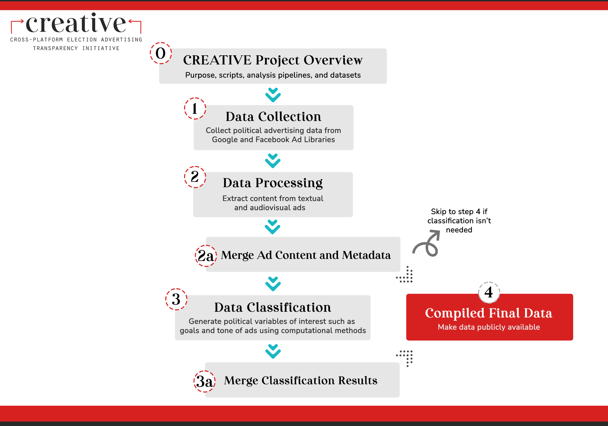

# The Cross-platform Election Advertising Transparency Initiative (CREATIVE)

## About

Welcome! This repo is a part of the [Cross-platform Election Advertising Transparency Initiative (CREATIVE)](https://www.creativewmp.com/). This is the overview repo of CREATIVE.

CREATIVE is an academic research project that has the goal of providing the public with analysis tools for more transparency of political ads across online platforms. In particular, CREATIVE provides cross-platform integration and standardization of political ads collected from Google and Facebook. CREATIVE is a joint project of the [Wesleyan Media Project (WMP)](https://mediaproject.wesleyan.edu/) and the [privacy-tech-lab](https://privacytechlab.org/) at [Wesleyan University](https://www.wesleyan.edu).

To analyze the different dimensions of political ad transparency we have developed an analysis pipeline.

For each of these steps in the pipeline we developed various scripts:

- [Step 0: Overview (this repo)](https://github.com/Wesleyan-Media-Project/creative_overview)
- [Step 1: Data Collection](https://github.com/Wesleyan-Media-Project/creative_overview/tree/main#step-1-data-collection)
- [Step 2: Data Processing](https://github.com/Wesleyan-Media-Project/creative_overview/tree/main#step-2-data-processing)
- [Step 3: Data Classification](https://github.com/Wesleyan-Media-Project/creative_overview/tree/main#step-3-data-classification)
- [Step 2a/3a: Data Merging](https://github.com/Wesleyan-Media-Project/creative_overview/tree/main?tab=readme-ov-file#step-2a3a-data-merging)
- [Step 4: Compiled Final Data](https://github.com/Wesleyan-Media-Project/creative_overview/tree/main#step-4-compiled-final-data)

Scripts in one repository may depend on scripts from a repository of a previous step. However, that is not always the case. It depends on what you want to do. Check out the documentation in the repository whose scripts you want to run to learn about any dependencies.

For our usage of variable names and acronyms check out our [Variable Wiki](https://github.com/Wesleyan-Media-Project/fb_entities_2020/wiki/Variable-Description).

## Step 1: Data Collection

### [Face Collection 2022](https://github.com/Wesleyan-Media-Project/face_url_scraper_2022) (face_url_scraper_2022)

This is a Python-based web scraper that extracts images of political figures from URLs and saves the results in a CSV file.

### [Facebook Ad Scraper](https://github.com/Wesleyan-Media-Project/fb_ad_scraper) (fb_ad_scraper)

This repository provides the scripts that replicate the workflow used by the Wesleyan Media Project to collect media (images and video) from Facebook ads.

### [Facebook Ads Import](https://github.com/Wesleyan-Media-Project/fb_ads_import) (fb_ads_imports)

Scripts used by the Wesleyan Media Project to import Facebook political ads.

### [Google Ads Archive](https://github.com/Wesleyan-Media-Project/google_ads_archive)

Scripts used by the Wesleyan Media Project to import Google political ads.

### [Facebook Aggregate Reports Import](https://github.com/Wesleyan-Media-Project/fb_agg_reports_import) (fb_agg_reports_import)

Scripts to collect and clean advertising reports from Facebook, ready to be analyzed.

### [Facebook PD ID](https://github.com/Wesleyan-Media-Project/fb_pd_id) (fb_pd_id)

This repository provides the scripts for generating the FB identity ids --- pd ids --- used by the Wesleyan Media Project.

## Step 2: Data Processing

### [Image Video Data Preparation](https://github.com/Wesleyan-Media-Project/image-video-data-preparation) (image-video-data-preparation)

This repository contains code that allows for selecting and preprocessing image and video data for the AWS Rekognition pipeline as well as querying text ads data.

### [Automatic Speech Recognition](https://github.com/Wesleyan-Media-Project/automatic-speech-recognition) (automatic-speech-recognition)

This repository contains code for replicating the workflow used by the Wesleyan Media Project to perform automatic speech recognition (ASR) on political ad videos.

### [AWS Rekognition Image Video Processing](https://github.com/Wesleyan-Media-Project/aws-rekognition-image-video-processing) (aws-rekognition-image-video-processing)

This repository contains code for replicating the workflow used by the Wesleyan Media Project to perform image and video recognition on political ads through the Amazon Rekognition service (AWS SDK for Python).

## Step 3: Data Classification

### [Entity Linking 2022](https://github.com/Wesleyan-Media-Project/entity_linking_2022)

This repository is central to the project and contains an entity linker for 2022 election data. This entity linker was trained on descriptions of election candidates and other people in the political process, including their names and aliases. Data are sourced from the 2022 WMP persons file, and are restricted to general election candidates and other non-candidate persons of interest (sitting senators, cabinet members, international leaders, etc.).

### [Race of Focus](https://github.com/Wesleyan-Media-Project/race_of_focus)

Scripts in this repository focus on what political race an ad is about (based on what candidates are mentioned in an ad). It needs to use the entity linker. It only contains data files (rdata and csv).

### [Aspect-Based Sentiment Analysis](https://github.com/Wesleyan-Media-Project/ABSA) (ABSA)

This repository contains code for the Aspect-Based Sentiment Analysis (ABSA) project. It contains data, models, and scripts for ABSA training.

### [Ad Tone](https://github.com/Wesleyan-Media-Project/ad_tone)

This repository contains models to predict the tone of political ads.

### [Party Classifier with Unique ID](https://github.com/Wesleyan-Media-Project/party_classifier_pdid) (party_classifier_pdid)

This repository contains the steps to train a party classifier and links for training results. The model performance is analyzed based on precision, recall, f1 score, and support for each party (Republican, Democrat, and Other).

### [Ad-level Party Classifier](https://github.com/Wesleyan-Media-Project/party_classifier) (party_classifier)

Multinomial party classifier classifying ads into DEM/REP/OTHER. The difference to the Unique ID party classifier is that for this classifier the training data consists of individual ads whose pd_id has party_all coded in the WMP entity file. By contrast, the Unique ID party classifier concatenates all ads of a pd_id into one.

### [Attack Like](https://github.com/Wesleyan-Media-Project/attack_like)

This repository contains the code for the attack-like negativity measure for the Facebook and Google datasets. The classifier outputs class labels (Support/Attack) as well as class probabilities. The probabilities can be used to construct a 'Contrast' label.

### [Ad Goal Classifier](https://github.com/Wesleyan-Media-Project/ad_goal_classifier)

The purpose of this repository is to classify the goals of advertisements across different data sources, including Facebook, TV, and Google. It involves a series of scripts that clean and prepare the data, train a machine learning model, and apply the trained model to different data sets for inference.

### [Issue classifier](https://github.com/Wesleyan-Media-Project/issue_classifier)

Issue classifier trained on 2018 and 2020 ads --- both TV and Facebook, designed to be applied to uncoded 2022 ads. Based on WMP issue coding --- not Kantar.

## Step 2a/3a: Data Merging

### [Data Post Production](https://github.com/Wesleyan-Media-Project/data-post-production)

This repo contains code that allows for merging different data fields and final data cleaning.

## Step 4: Compiled Final Data

### [Datasets](https://github.com/Wesleyan-Media-Project/datasets)

This repository is a place to store datasets whose creation is not assumed to be replicable (but which are used as inputs to other scripts or resources that are meant to be replicable from that point on).

### [Facebook Page Names](https://github.com/Wesleyan-Media-Project/fb_page_names) (fb_page_names)

This repository contains data and SQL scripts showing the history of changes in page names of FB advertisers. It describes the known problems with changes in page names of Facebook advertisers.

## Note on R and RData files (by @markusneumann)

RData files are the standard way of saving data in R. WMP uses them because (1) they are compressed by default, so they are smaller than csvs and (2) because they retain information on data types. So, for example, we have ad ids, which are numbers. An ad id might be 2323532312. If we save data as a csv and then reimport it, the importer makes some assumptions on each object's types and sometimes it is wrong. This can cause those objects to be irreversibly mangled. To avoid that, in R, we tend to set them to strings, not integers (this is standard practice in computational social science). And if it is later loaded from an rdata file, it will know it is a string. Whereas if it is imported from a csv, it will usually think it is an integer, but depending on how high it is it will encode it as int16, int32, etc. and that can cause problems.

[Here are the results of some experiments with file compression of rdata and alternatives](https://github.com/Wesleyan-Media-Project/github_howto/wiki/File-compression)

## Thank You

<strong>We would like to thank our supporters!</strong>
 

This material is based upon work supported by the National Science Foundation under Grant Numbers 2235006, 2235007, and 2235008.

  

The Cross-Platform Election Advertising Transparency Initiative (CREATIVE) is a joint infrastructure project of the Wesleyan Media Project and privacy-tech-lab at Wesleyan University in Connecticut.

  

  

  

